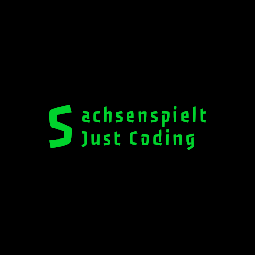

  

  <h1>Hi 👋 I'm Finn!</h1>

Hi, I'm <b>Finn</b>, also known as <b>SachsenspieltCoding</b> on GitHub.   I'm a student from Saxony, Germany 🇩🇪, an event technician in school, and a Full-Stack developer as a hobbyist.   You can find me on <a href="https://discord.com/">Discord</a> as @sachsenspielt and on <a href="https://dresden.network/@sachsenspielt">Mastodon</a>.

---

## About Me

I'm a passionate developer for Full-Stack web applications. But I also have interests in game development. 

In addition to my technical pursuits, I'm also passionate about German railroading and firefighting, which are two of my other interests.

My current focus is on:

### ✨ Montimus
An open-source, self-hosted monitoring solution with customizable status pages. Montimus is currently under heavy development, and you can check out the progress on [GitHub](https://github.com/SachsenspieltCoding/montimus/).

### ✨ Cubyx Network
I serve as the Lead Developer and administrator for Cubyx Network, where I'm actively working on developing the website. You can follow our progress on [GitHub](https://github.com/Cubyx-Network/website).

### ✨ Vertretungsapp
Vertretungsapp is an alternative to the indiware app VpMobil. Although there is no active development at the moment, you can explore the project on [GitHub](https://github.com/Vertretungsapp/).

Feel free to explore these projects, contribute, or reach out to me with any questions or collaboration opportunities. I'm always excited to connect with fellow developers and open-source enthusiasts.
